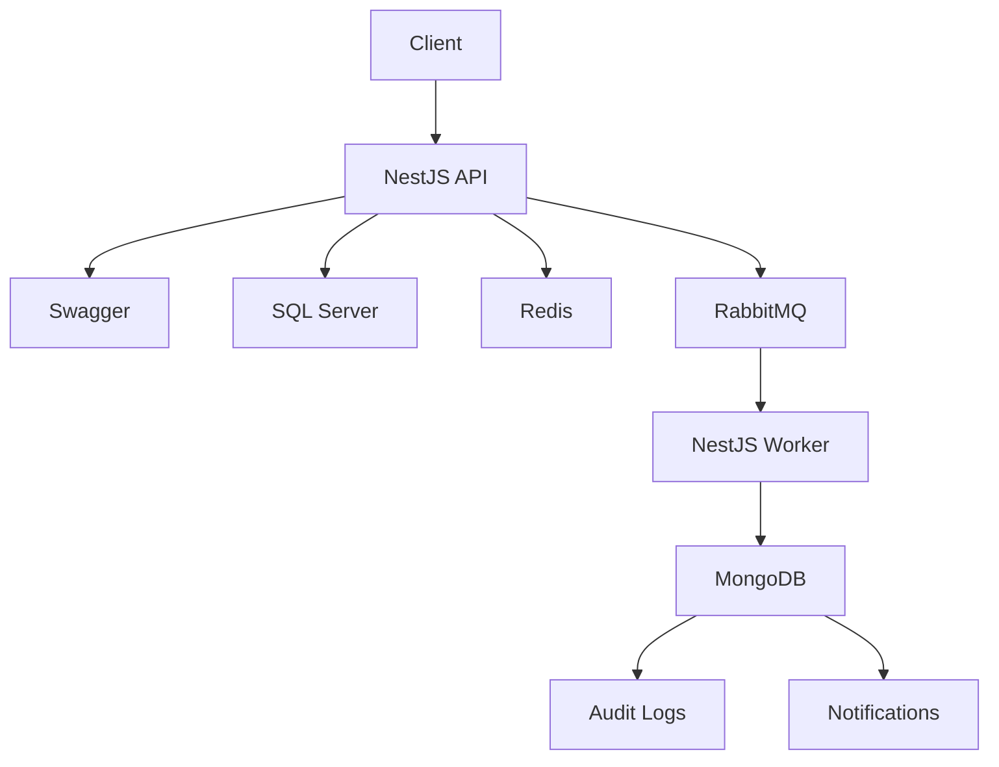
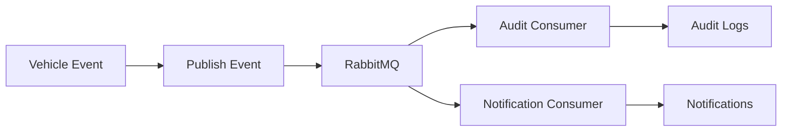
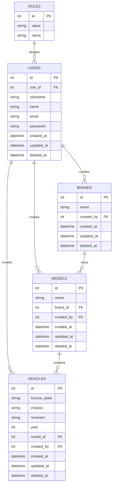

# Arquitetura da Solução

| Item                 | Tecnologia  |
| -------------------- | ----------- |
| Arquitetura          | MVC Modular |
| API                  | NestJS      |
| Banco Relacional     | SQL Server  |
| Cache                | Redis       |
| Mensageria           | RabbitMQ    |
| Banco Não Relacional | MongoDB     |
| Autenticação         | JWT         |
| Autorização          | Roles       |
| Documentação         | Swagger     |
| Testes               | Jest        |
| Containerização      | Docker      |

---

# Arquitetura Geral



---

# Tecnologias Utilizadas

| Tecnologia | Finalidade                |
| ---------- | ------------------------- |
| NestJS     | API e Worker              |
| SQL Server | Persistência transacional |
| Redis      | Cache                     |
| RabbitMQ   | Mensageria                |
| MongoDB    | Auditoria e notificações  |
| JWT        | Autenticação              |
| Roles      | Autorização               |
| Swagger    | Documentação da API       |
| Jest       | Testes automatizados      |
| Docker     | Containerização           |

---

# Módulos da Aplicação

| Módulo        | Responsabilidade                   |
| ------------- | ---------------------------------- |
| Auth          | Autenticação JWT                   |
| Roles         | Perfis e autorização               |
| Users         | Gerenciamento de usuários          |
| Brands        | Gerenciamento de marcas            |
| Models        | Gerenciamento de modelos           |
| Vehicles      | Gerenciamento da frota             |
| Audit         | Registro e consulta de auditoria   |
| Notifications | Consulta e leitura de notificações |
| Queue         | Publicação e consumo de eventos    |

---

# Fluxo de Eventos



---

# Estrutura de Pastas

```txt
src/

├── main.ts
├── worker.ts

├── modules/
│   ├── auth/
│   ├── roles/
│   ├── users/
│   ├── brands/
│   ├── models/
│   ├── vehicles/
│   ├── audit/
│   ├── notifications/
│   └── queue/

├── common/
│   ├── decorators/
│   ├── filters/
│   ├── guards/
│   ├── interceptors/
│   └── exceptions/

├── config/

├── database/
│   ├── migrations/
│   └── seeds/

└── tests/
```

---

# Modelagem de Dados



---

# Persistência

| Tecnologia | Utilização                              |
| ---------- | --------------------------------------- |
| SQL Server | Roles, Users, Brands, Models e Vehicles |
| MongoDB    | Audit Logs e Notifications              |
| Redis      | Cache de consultas                      |
| RabbitMQ   | Eventos assíncronos                     |

---

# Dados Não Relacionais

## Audit Logs

Audit Logs são registros globais de eventos da aplicação.

Devem conter o ator responsável pela ação.

Consulta protegida por JWT e restrita a usuários com role `ADMIN`.

Rotas previstas:

```txt
GET /audit-logs
GET /audit-logs/:id
```

## Notifications

Notifications são registros vinculados ao usuário.

Devem conter `userId` obrigatório.

Consultas retornam apenas notificações do usuário autenticado.

Rotas previstas:

```txt
GET /notifications
GET /notifications/:id
PATCH /notifications/:id/read
```

---

# Estratégia de Exclusão

```txt
Soft Delete
```

Campo utilizado:

```txt
deleted_at
```

Regras:

```txt
Registros deletados não são retornados por padrão.

Models não podem referenciar Brands deletadas.

Vehicles não podem referenciar Models deletados.

Campos únicos permanecem globalmente únicos mesmo após Soft Delete.
```

---

# Índices

```txt
roles.value (UNIQUE)

users.email (UNIQUE)

users.role_id

brands.name (UNIQUE)

brands.created_by

models.brand_id

models.created_by

vehicles.license_plate (UNIQUE)

vehicles.chassis (UNIQUE)

vehicles.renavam (UNIQUE)

vehicles.model_id

vehicles.created_by
```

---

# Eventos de Domínio

```txt
vehicle.created

vehicle.updated

vehicle.deleted
```

---

# Documentação da API

Swagger disponível através do endpoint:

```txt
/api/docs
```
